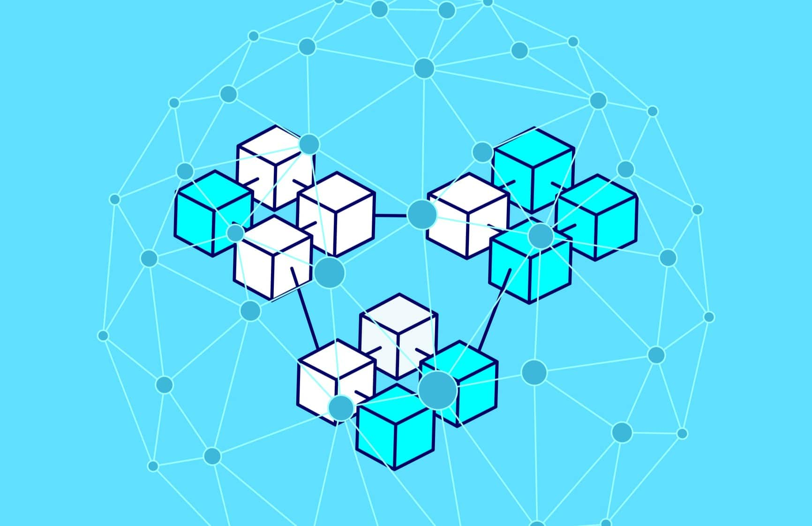

<a name="readme-top"></a>

<div align="center">
  <a href="https://github.com/CS-DaviMagalhaes/Proyecto_Algoritmos_y_Estructuras">
    
  </a> 
  <h1>🔷 Aplicación de retiro de dinero con blockchain 🔶</h1>
  
  <p>
  
  </p>
</div>

<details open>
  <summary>Tabla de contenidos:</summary>
  <ol>
    <li><a href="#acerca-del-proyecto">
      Acerca del proyecto
      <ul>
        <li><a href="#introducción1">Introducción</a></li>
        <li><a href="#caso-de-estudio">Caso de estudio</a></li>
        <li><a href="#importancia-de-blockchain">Importancia de blockchain</a></li>
        <li><a href="#estructura-de-blockchain">Estructura de blockchain</a></li>
        <li><a href="#estrategia-usada-integridad">Estrategia usada para asegurar la integridad del contenido</a></li>
        <li><a href="#estructura-de-datos-usadas">Estructuras de datos usadas</a></li>
      </ul>
    </a></li>
    <li><a href="#autores">
      Autores
    </a></li>
    <li><a href="#referencias">
    Referencias bibliográficas
    </a></li>
    <li><a href="#anexos">
      Anexos
    </a></li>
  </ol>
</details>

---

## Acerca del proyecto

### Introducción
El Blockchain o cadena de bloques es un libro mayor digital o una lista de registros electrónicos de transacciones que son almacenadas en bloques secuenciales que se conectan entre sí en cadena. El blockchain utiliza un algoritmo para asignar una *huella digital* a cada bloque, conocido como *hash*, que es una cadena única criptografada de letras y números que cambia si es que se altera la información del bloque. Cada bloque almacena el hash propio y del bloque anterior de tal forma que si se hace una alteración en un bloque todos los bloques posteriores son afectados. El Blockchain también se caracteriza por la ausencia de un intermediario para autenticar las transacciones.

### Caso de estudio
El presente proyecto consiste en una aplicación basada en el uso de Blockchain, el cual nos permite realizar transacciones y almacenarlos de manera segura. En este caso, las transacciones monetarias entre individuos viene a ser **el retiro**, y se hacen mediante el uso del hashing SHA256.
Este hash nos permite encriptar esta informacion que viene a ser una combinación de números y letras. Además, este identificador puede ser actualizado de diversas formas, un ejemplo de ello es cuando se hace un cambio a un bloque. Asimismo, cada blockchain cuenta con un valor *nonce* que viene a ser un número único que comprende una combinación con una cadena de datos del bloque al que pertenece.
### Importancia del blockchain
El blockchain es una tecnología que nos permite llevar un registro seguro, sincronizado, descentralizado, el cual no necesita de la intervención de terceros. Por lo tanto, es ideal para hacer seguimiento de pedidos, pagos, cuentas y en este proyecto que trata de una simulación de retiro de dinero como en un banco.
Es una base de datos distribuida donde todos los nodos tienen un registro de la información todo el tiempo. Pasando de una lógica centralizada, dónde alguien controla toda la información, a una distribuida, dónde la información se divide entre todas las computadoras. Dónde nadie puede monopolizar los contenidos porque todas las computadoras se ponen de acuerdo en cuál es la base de datos única donde van a converger.
### Estructura del blockchain
La estructura de datos del blockchain tiene el siguiente esquema:

```cpp
class Blockchain {
   private:
    List<Block *> *chain = new DoubleList<Block *>();
    Heap<retiro>* heap_fechaMax = new Heap<retiro>(10, Heap<retiro>::MAX_HEAP);
    Heap<retiro>* heap_fechaMin = new Heap<retiro>(10, Heap<retiro>::MIN_HEAP);
    HeapMon<retiro>* heap_montoMin = new HeapMon<retiro>(10, HeapMon<retiro>::MIN_HEAP);
    HeapMon<retiro>* heap_montoMax = new HeapMon<retiro>(10, HeapMon<retiro>::MAX_HEAP);

    unsigned int size_chain = 0;
    
   public:
    // Constructor
    Blockchain() {}

    // Public Functions
    void addBlock(retiro *data);
    void show_blockchain();
    void import_blockchain(const string& archivo);
    void test_proof_work(int id);
    void fix_all();
    void max_value(string tipe);
    void min_value(string tipe);

};
```

**Explicación de los atributos**

`chain` : Se implementó una lista que almacena punteros a bloques. Cada bloque guarda la información de un retiro de dinero. El retiro de dinero tiene un cliente, un lugar, un monto y una fecha. Por otro lado, el bloque presenta un id, un nonce, un retiro de dinero (objeto que presenta las caracteristicas previamente descritas), un hash para mantener cifrada la identidad del usuario, el hash previo a este y un booleano que indica si el bloque es válido o no.

`heap_fechaMax` : Se crea una estructura max-heap donde se almacenará las fechas de los retiros hechos. Esto servirá para obtener la fecha más actual en la que se hizo un retiro de dinero.

`heap_fechaMin` : Se crea una estructura min-heap donde se almacenará las fechas de los retiros hechos. Esto servirá para obtener la fecha más antigua en la que se hizo un retiro de dinero.

`heap_montoMax` : Se crea una estructura max-heap donde se almacenará los montos de dinero de los retiros hechos. Esto servirá para obtener la el monto más alto.

`heap_montoMin` : Se crea una estructura min-heap donde se almacenará los montos de dinero de los retiros hechos. Esto servirá para obtener el monto más bajo.

`size_chain`: Cantidad de bloques o de transacciones, en términos del proyecto, cantidad de retiros de dinero de los clientes.

**Explicación del constructor**

El constructor es uno por defecto, ya que una cadena de bloques siempre empieza vacía. Entonces, simplemente cuando se quiere crear un objeto blockchain se llama a la clase sin necesidad de pasarle ningun argumento. Si se desea añadir información a este, entonces allí se empiezan a llamar a los métodos de la clase, como por ejemplo el método inicial sería el de añadir bloques (`addBlock(retiro *data)`).

**Explicación de los métodos**

`addBlock` : Se recibe como argumento un objeto de tipo retiro que representa el retiro de dinero del cliente.
El algoritmo empieza preguntando si ya existe un bloque en la cadena, si es que existe entonces se crea dos bloques, uno que será el bloque a añadir y el otro el último bloque de la cadena. Despues, se genera el id, el código hash del nuevo bloque y se manda el hash del último bloque. Por último, se añade el bloque a la cadena y se aumenta en una unidad la variable size_chain

En el caso en el que no existe un bloque en la cadena. Entonces, se crea un solo bloque que será el nuevo, se genera el id y un código hash para el nuevo bloque y se manda un string vacio en el dato del hash previo, porque no existe un bloque anterior a este. Para terminar se añade el bloque a la cadena y se aumenta en una unidad la variable size_chain

`show_blockchain` : Se crea un iterador para la lista de bloques. Con el iterador creado se recorre la lista, se crea un nuevo bloque que se llama current porque en cada iteración se actualizará con el bloque actual. Al final, se llama a una función del bloque para imprimir todos sus datos.

`import_blockchain` : Recibe como argumento un string que es la ruta del archivo csv a importar. Despues, se comienza a recorrer cada línea del archivo. En cada línea se recorre palabra por palabra se reconoce por la separación de comas, una vez separadas las palabras se agregan a un vector. Por último, si el tamaño del vector es 4, entonces quiere decir que el registro esta completo, se pasa a agregar cada elemento a un objeto retiro; una vez creado el objeto se manda como argumento a la funcion de añadir bloque.

`test_proof_work` : Esta función se utiliza para realizar pruebas y modificar un bloque específico en la cadena de bloques. Toma como argumento un identificador de bloque (id) y realiza las siguientes acciones:

- Itera a través de la cadena de bloques hasta llegar al bloque con el identificador especificado.
- Solicita al usuario que ingrese un nuevo nombre para el lugar de retiro en ese bloque.
- Pregunta al usuario si desea arreglar el blockchain.
- Si el usuario elige no arreglarlo (valor 0), establece una bandera (flag1) para indicar que se debe ajustar el hash previo en el próximo bloque.
- Si el usuario elige arreglarlo (valor 1), realiza el proceso de minería en ese bloque para obtener un hash válido y establece una bandera (flag2) para indicar que el hash previo debe ajustarse en el próximo bloque.

`fix_all` : Esta función se utiliza para corregir todos los bloques no validados en la cadena de bloques. Itera a través de la cadena de bloques y realiza las siguientes acciones:

- Verifica si el bloque actual tiene validación (get_validation()) establecida como falsa.
- Si es así, ajusta el hash previo en el bloque actual y realiza el proceso de minería para obtener un hash válido.

`max_value` : Esta función recibe un string que ayuda a saber si se pregunta por la fecha más actual o el monto mayor. Luego, se llama al atributo de la estructura heap ya sea de fecha o de monto para obtener su valor top, en este caso nos retornaría el objeto retiro que cumple con tener el elemento mayor. Una vez obtenido este objeto, se pasa a imprimir los datos del retiro del cliente.


`min_value` : Esta función es utilizada para poder obtener el  bloque con el valor mínimo ya sea de monto o fecha. Esta función te pide ingresar un string para poder saber si el valor mínimo a buscar será de monto o fecha; dependiendo cada caso se llama al heap correspondiente. Si es para monto se llama al top del heap "heap_montoMin", si es para fecha se llama al top del heap "heap_fechaMin". Despúes de llamar al top, se imprimen todos sus datos.


### Estrategia usada para asegurar la integridad del contenido

Se utilizo hashing, implementandolo en cada blockchain con un hash prev y next para mantener una comunicación entre un blockchain anterior y siguiente, conteniendo en cada bloque la información requerida, de tal forma que no se pueda cambiar ningún dato, pero para probar la efectividad al cambiar los datos el hash formado por cada block cambia en consecuencia (proof of work)

### Estructuras de datos usadas
Estas son las estructuras de datos que fueron utilizadas para la implementación de esta aplicación.
- Vector
- Heap
- List

### Análisis de complejidad algorítmica
>- **block.h**:

La complejidad de este código es principalmente lineal, O(n), donde "n" es el tamaño de los datos procesados. Hay varias operaciones que se realizan una vez o un número constante de veces, por lo que no afectan significativamente la complejidad general.

Aquí hay algunas operaciones clave y su complejidad asociada:


**Creación de un objeto Block:**

O(1) - Las asignaciones y la inicialización de variables son operaciones de tiempo constante.

**Función "mine()":** 

La complejidad depende del bucle "while (true)" y de la generación de hash. En el peor caso, el bucle puede iterar hasta que se encuentre un hash válido, lo que podría llevar un tiempo considerable. Por lo tanto, en el peor caso, la complejidad sería O(m * n), donde "m" es el número de iteraciones del bucle y "n" es el tamaño de los datos.


**Función "reHash()":**

O(n) - La generación del hash y las comparaciones tienen un tiempo de ejecución lineal dependiendo del tamaño de los datos.

**Otras funciones:**

La mayoría de las otras funciones tienen complejidad O(1) ya que realizan operaciones de tiempo constante, como asignaciones y comparaciones.

En general, el código parece tener una complejidad razonable y no hay operaciones que indiquen un rendimiento deficiente.


>- **BlockChain.h**:

La complejidad de este código de la clase Blockchain es principalmente lineal, O(n), donde "n" es el número de bloques en la cadena.

Aquí hay algunas operaciones clave y su complejidad asociada:

**Función "addBlock(retiro data)":**

O(n) - La función crea un nuevo bloque y lo agrega al final de la cadena. El tiempo de ejecución depende del tamaño de la cadena existente, ya que se necesita recorrer la cadena para encontrar el último bloque.

**Función "show_blockchain()":**

O(n) - La función muestra la información de cada bloque en la cadena. Como se recorre la cadena completa, la complejidad es lineal en relación al número de bloques.

**Función "import_blockchain(const string& archivo)":**

O(m * n) - La función importa una cadena de bloques a partir de un archivo CSV. El tiempo de ejecución depende del número de líneas en el archivo (m) y del número de bloques en la cadena existente (n).

**Función "test_proof_work(int id)":**

O(n) - La función permite realizar pruebas y modificaciones en un bloque específico de la cadena. Recorre la cadena hasta encontrar el bloque deseado y realiza operaciones que tienen una complejidad constante.

**Función "fix_all()":**

O(n) - La función recorre toda la cadena y verifica si cada bloque es válido. Si un bloque no es válido, se realiza una corrección y se vuelve a calcular el hash. Por lo tanto, la complejidad es lineal en relación al número de bloques.

En general, la complejidad del código de la clase Blockchain es lineal y eficiente en términos de rendimiento.

>- **SHA256.h** 
La función de hash SHA-256 en C++. La complejidad del código depende de varios factores, como la longitud del mensaje de entrada y el tamaño de los bloques de datos utilizados en el algoritmo. A continuación, se presenta un análisis general de la complejidad de las secciones principales del código:


**Conversión del texto de entrada a binario:**

La función text_to_binary recorre cada carácter del texto de entrada y genera su representación binaria de 8 bits. Por lo tanto, la complejidad de esta función es lineal con respecto al tamaño del texto de entrada, O(n), donde n es la longitud del texto.
Generación de los bloques de datos:

El código divide el mensaje binario en bloques de 512 bits (chuncks) y los almacena en el vector bloqueBits. La complejidad de esta sección depende del tamaño del mensaje binario. Si el mensaje binario tiene una longitud de m bits, la complejidad sería O(m/512).
Compresión de datos:

La sección de compresión de datos ejecuta un bucle for en función del número de bloques de datos generados en el paso anterior. En cada iteración, se realizan operaciones matemáticas en los bloques de datos y los valores hash 'h'. El bucle ejecuta un total de 64 iteraciones, independientemente del tamaño del mensaje de entrada. Por lo tanto, la complejidad de esta sección es O(64 * k), donde k es el número de bloques de datos generados.
Mutación final de los valores hash 'h':

Después de la compresión de datos, se realizan modificaciones finales en los valores hash 'h'. Esta sección es constante y no depende del tamaño del mensaje de entrada.

**Conversión de los valores hash 'h' a hexadecimal:**

La sección final convierte los valores hash 'h' de cada bloque en su representación hexadecimal. Esto implica convertir cada valor de 32 bits a su representación hexadecimal de 8 caracteres. Dado que hay 8 valores hash 'h', la complejidad de esta sección es constante.
En resumen, la complejidad general del código puede aproximarse a O(n), donde n es la longitud del texto de entrada. Sin embargo, se debe tener en cuenta que el análisis proporcionado es una estimación simplificada y no tiene en cuenta todos los detalles y operaciones dentro de las funciones auxiliares utilizadas en el código.

### Conclusiones
En conclusión, el proyecto demuestra la implementación de un sistema de blockchain funcional y seguro que utiliza diversas estructuras de datos, como vectores, heaps y listas enlazadas, cada una con sus operaciones respectivas. En términos de complejidad algorítmica, el proyecto presenta complejidades eficientes en casi todas las operaciones. Elegimos el caso de estudio específicamente para *retiro* donde cada bloque contiene información sobre un retiro de dinero, como el cliente, el lugar, el monto y la fecha. Para garantizar la integridad de los datos, se utiliza el concepto de hashing, donde cada bloque tiene un hash que se genera a partir de su contenido y del hash del bloque anterior.

### Autores
- Davi Eler Magalhães
- Allyson Tiphany Sánchez Báez
- Maria Fernanda Surco Vergara
- Flavia Ailen Mañuico Quequejana
- Yamileth Yarel Rincón Tejeda

### Referencias bibliográficas
- What is blockchain technology? - AWS
  https://aws.amazon.com/what-is/blockchain/?nc1=h_ls&aws-products-all.sort-by=item.additionalFields.productNameLowercase&aws-products-all.sort-order=asc
- ¿Qué es la tecnología Blockchain? - IBM
  https://www.ibm.com/es-es/topics/blockchain
- Descripción de la Cadena de Bloques - AMD
  https://www.amd.com/es/technologies/blockchain-explained
- SHA256 - A C++ SHA256 Implementation
  https://github.com/System-Glitch/SHA256
---

[Back To The Top](#readme-top)

